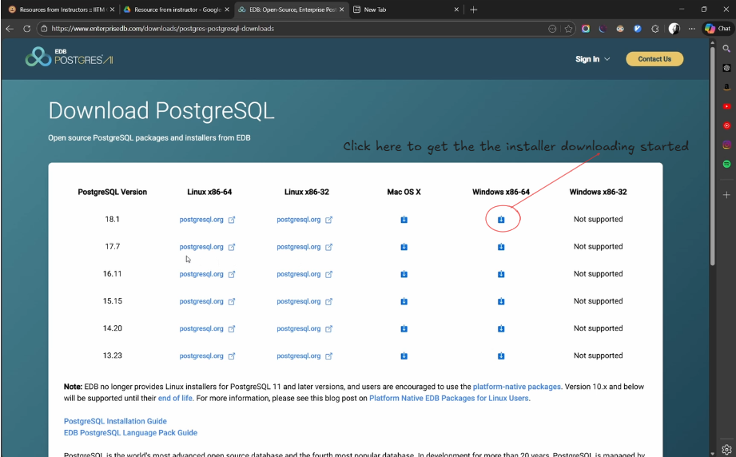
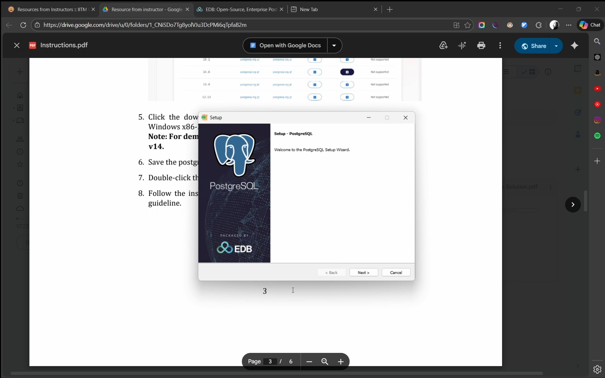
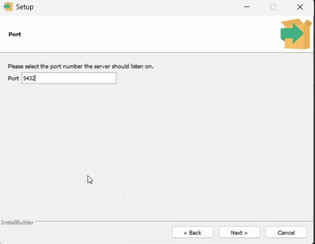
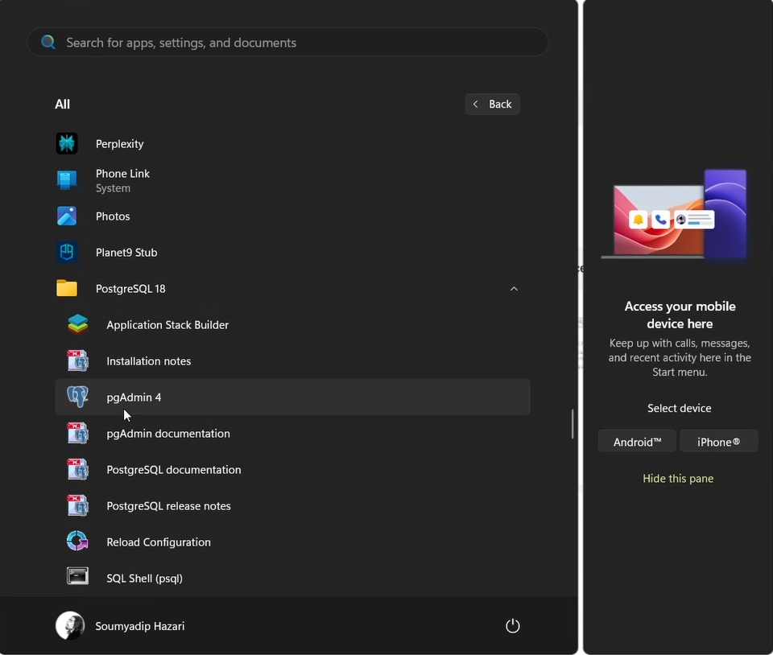
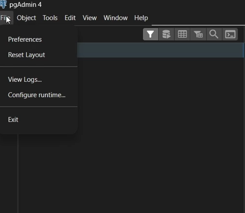
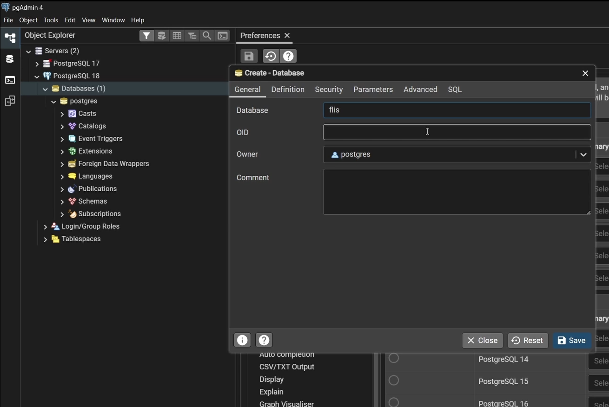
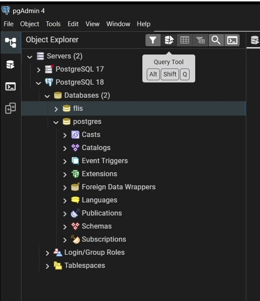
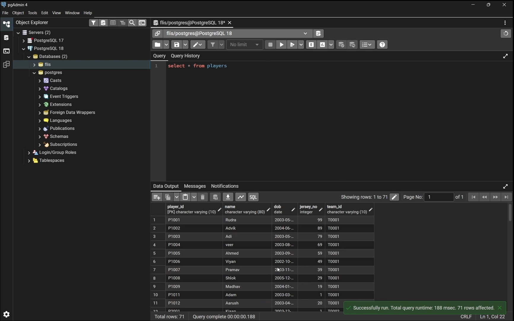

# Downloading and Installing PostgreSQL

You can follow this tutorial video if you don't want to read this https://www.youtube.com/watch?v=q7Y4wFUc2f8

## Downloading PostgreSQL

1. Go to this website https://www.postgresql.org/download/
2. Choose the Operating system (I have selected windows)

3. Choose the version of the postgreSQL as you like (recommended is to get the latest one)

4. Wait for the installer to get downloaded

## Installing the PostgreSQL

1. Click on the installer that has been downloaded 

2. Click on next

3. Keep the directory as it is and click on next

4. Keep all the things checked and then click on next

5. Provide the password and remember it as it will ask you for the password later and click on next.

6. keep the port as it is and click on next

7. click on next

8. Click on next then your installation will start and then wait for the installation to end.

## Setting up the PostgreSQL

1. Download the tar files that are given by IITM (you can find it here also https://drive.google.com/drive/folders/1KYYPGF7XWFJTw07n33Z0RJpHKNKv8fC5)

2. Create a new folder and save this there.

3. Open pgAdmin 4

4. After opening pgAdmin 4 in the top bar find **file** option then from there go to the **Preferences** 

5. If your installation process was correct then your binary path (under the path section) will contain the bin location 
   

6. After that extend the server option and you will see PostgreSQL with its version and click on that and it will ask for the password, give the password that you gave during the installation (step no.5 from installation process)

7. Then it will extend then right click on **Databases** --> **Create** --> **Database**

8. Then give the **Database** a name it will be good if you give the name same as the tar file and click on save it 

9. after that in the database that you created recent right click on it and select the option **Restore**

10. After that in the restore box select  the **file icon** in the **Filename** option and select the tar file where you have save it and then click on **Restore** option

congratulation You have successfully restored the database

11. Select the **query tool** and write your query's and run it 

Thank you for Reading this instructions patiently :)